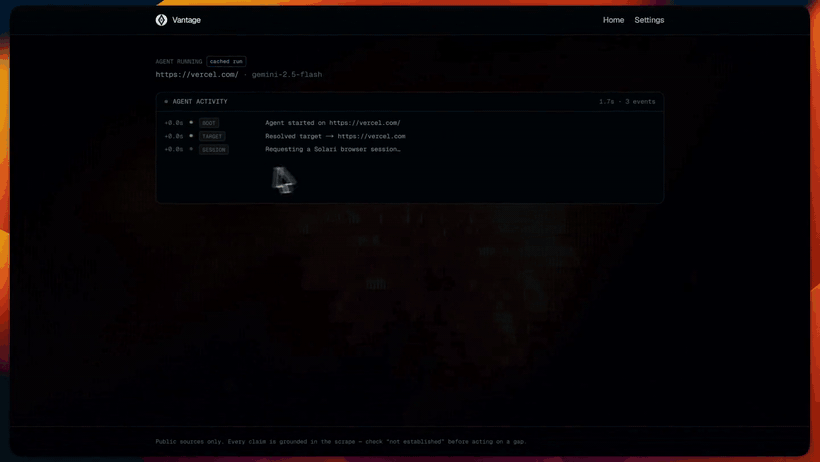
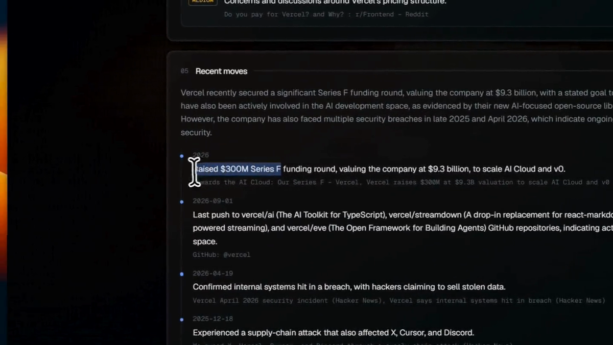

<div align="center">

# Vantage

### Know your competition. Before they know themselves.

Drop in a competitor's URL. An agent browses their site and the public web, then a
model of your choosing writes a structured teardown — positioning, pricing, tech
stack, complaints, momentum, and the gaps you could exploit — while you watch it
work in real time.

[](https://nextjs.org)
[](https://www.typescriptlang.org)
[](https://tailwindcss.com)
[](https://getsolari.com)

[](https://console.anthropic.com)
[](https://platform.openai.com)
[](https://aistudio.google.com)




**[▶ Watch the full 95-second walkthrough](public/demo.mp4)**

</div>

---

## What it actually does

Most competitor research tools summarise the company's own marketing copy back at
you. This one browses, corroborates against sources the company does not control,
and tells you what it could not establish.



A single run produces:

| Section | Grounded in |
|---|---|
| **Positioning** | Homepage and about page |
| **Pricing** | The pricing page, tier by tier |
| **Tech stack** | Script/link/meta fingerprints — detected, not guessed |
| **Complaints** | Search results, ProductHunt, Hacker News |
| **Recent moves** | Dated Hacker News stories and GitHub push activity |
| **Opportunities** | Wedges tied to something observed in the data |

Plus a confidence level, an explicit *"not established by this run"* list, a
Markdown export, and a replayable recording of the browsing session.

---

## Quick start

```bash
npm install
cp .env.example .env.local     # add your Solari key
npm run dev
```

Open <http://localhost:3000>, add a model API key under **Settings**, and run a
teardown from the hero field.

> **No key handy?** The four examples on the home page — `vercel.com`, `cal.com`,
> `posthog.com`, `supabase.com` — replay saved runs in ~14 seconds, free.

### Environment

One server-side secret, and only one:

```
SOLARI_API_KEY=slr_live_...
```

Model keys are **never** configured here. Each user brings their own.

### Fonts

The UI is designed for two variable faces, **Reference Sans** and **Reference
Display**. Drop `ReferenceSans.woff2` and `ReferenceDisplay.woff2` into
`public/fonts/` to get them; without those files the stack falls through to Geist
and the layout is unaffected.

---

## How a run works

```
POST /api/run  ──►  202 { id }      client opens EventSource on /api/status/[id]
                     │
          ┌──────────┴──────────────────────────────────────────┐
          │  Solari session (stealth + recording)               │
          │    homepage ──► /pricing + /about   (parallel)      │
          │    3 web searches + ProductHunt     (parallel)      │
          └──────────┬──────────────────────────────────────────┘
                     │  Hacker News + GitHub over plain HTTPS (no browser)
                     ▼
             dossier (~2-4k tokens)  ──►  your model  ──►  teardown JSON
```

Collection takes **~18-30 seconds**. The whole run is capped at 90 seconds by a
hard watchdog that races the agent — Playwright ignores `AbortSignal`, so a
cooperative cancel alone cannot guarantee a run ever ends. One run at a time,
enforced on both the client and the server.

---

## Honest sourcing

Competitive research is only useful if you can trust it, so the agent fails loudly
rather than quietly.

- **Every source failure is shown** in the live feed and passed to the model, so a
  blocked page becomes a stated gap rather than an invented fact.
- **Search results must mention the target.** From a datacenter IP, Bing answers
  blocked queries with HTTP 200 and an *identical canned SERP for every query*. A
  result set where nothing names the company is treated as a failure — a silently
  wrong source is worse than a missing one.
- **Tech-stack signals are detected deterministically** from script, link, and meta
  tags rather than guessed by the model.
- **A missing homepage is not fatal.** Search, Hacker News, and GitHub still run,
  and the report says what was lost.

### On stealth

Sessions launch with `stealth: true`. Measured from a Solari egress IP:

| Engine | Without stealth |
|---|---|
| Google | "unusual traffic" interstitial |
| DuckDuckGo | captcha |
| Brave | 429 |
| Mojeek | 403 |
| Startpage | hard block |
| Bing | HTTP 200 — with a canned SERP that ignores the query |

With stealth on, DuckDuckGo answers correctly. The launch falls back to a
non-stealth session if the plan disallows it; the run still completes, with the
search phase degraded and marked as such in the feed.

---

## Bring your own key

The app ships no model credentials. When you start a run, your key:

- travels in the `POST /api/run` body,
- is held only in the in-flight closure for that one call,
- is **never** written to the run record, the event log, or any response body,
- lives in that browser tab's `sessionStorage`, and nowhere else.

**Verify key** calls `POST /api/models`, which lists the models that key can
actually use — validating the key and populating the picker with real, current
model IDs instead of hard-coded ones that go stale.

> Deploy behind HTTPS. On `localhost` the key is fine; over plain HTTP it would
> cross the network in clear text.

### Token cost

The dossier is kept small on purpose — 2,600 chars per page, 5 search results per
query, 6 Hacker News hits. A typical run sends **~2-4k tokens** and caps output at
6,000. The live feed prints the estimate before each call.

If you are on a low OpenAI tier, note that `max_tokens` counts against your
tokens-per-minute budget as a *reservation* — which is why the output ceiling is
6k and not 16k.

---

## Session replay

Every browser session is recorded, and the report has a **watch agent replay**
button. Failed runs get one too — that is when watching what the agent saw matters
most.

The recording is not a video: Solari captures an **rrweb event log** (DOM
snapshots plus mutations), so `/replay/[id]` rebuilds the pages in an iframe and
plays them back on a scrubbable timeline. Text stays selectable and the inactive
gaps between pages are skipped.

`GET /api/replay/[id]/events` proxies the log — minting a fresh presigned URL,
gunzipping, and returning JSON. Proxied because the presigned link expires after
**900 seconds** and the bucket serves no CORS headers for our origin.

---

## Demo mode

Clicking an example **replays a saved run** rather than browsing live: no API key,
no quota, ~14 seconds, identical every time.

Fixtures are never hand-written. One is created only when a genuine run completes
successfully — the real events, the real teardown, and the session recording are
written to disk:

```
demo-fixtures/vercel.com.json               events + teardown
demo-fixtures/vercel.com.replay.ndjson.gz   the rrweb recording
```

So a replay is a *cache of real output*, not a mock-up, and the report marks it
with a **cached run** badge. A host with no fixture yet just runs live — and that
run seeds the fixture for next time.

```bash
# Back-fill a run that finished before capture existed
curl -X POST localhost:3000/api/demo/capture \
  -H 'content-type: application/json' -d '{"runId":"<run-id>"}'
```

---

## Project layout

```
app/
  page.tsx                     landing — hero, competitor URL, one-click examples
  settings/page.tsx            bring-your-own-key: provider, key, model
  report/[id]/page.tsx         live agent feed, then the teardown
  replay/[id]/page.tsx         rrweb playback of the recorded session
  api/run/route.ts             starts a run (or replays a fixture)
  api/status/[id]/route.ts     SSE stream
  api/models/route.ts          model discovery + key validation
  api/replay/[id]/...          presigned redirect + event proxy
  api/demo/capture/route.ts    back-fill a demo fixture
lib/
  solari.ts     browser session, scraping, fingerprinting, search ladder
  sources.ts    Hacker News + GitHub over plain HTTPS
  agent.ts      orchestration and phase deadlines
  prompt.ts     system prompt, JSON schema, dossier rendering
  claude.ts / openai.ts / gemini.ts     provider adapters
  llm.ts        dispatch (server-only)  ·  providers.ts  metadata (client-safe)
  store.ts      in-memory run store + SSE pub/sub
  demo.ts       fixture capture and replay
  markdown.ts · timezone.ts · storage-keys.ts · types.ts
components/
  VantageLanding · VantageBackdrop · AppChrome
  ProviderPicker · SettingsForm
  StatusFeed · TeardownReport · RunView · ReplayPlayer
```

---

## Notes and limits

- **Stateless by design.** Reports live in a process-local `Map` for one hour and
  do not survive a restart. No auth, no database.
- **Single process.** The in-memory store and the one-run-at-a-time guard assume
  one server instance.
- `@solarisdk/browser` and `patchright-core` are declared as
  `serverExternalPackages` — they drive a real Chromium and cannot be bundled.
- ProductHunt frequently yields nothing; it degrades to a warning rather than
  failing the run. Hacker News covers most of the same ground.

## Scripts

```bash
npm run dev     # dev server
npm run build   # production build
npm run start   # serve the build
npm run lint    # eslint
```

<div align="center">
<sub>Built with <a href="https://getsolari.com">Solari</a> · Public sources only</sub>
</div>
